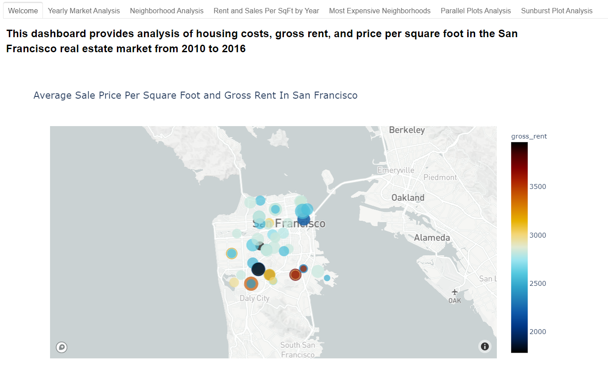

<h3 align="center">San Francisco Rental Analysis Dashboard Using Python</h3>

  

### Project Overview:
* Create neighborhood statistic DataFrames for San Francisco and generate plots:
    * Price per SqFt
    * Housing Units
    * Gross rent
    * Avg Price per SqFt
    * Incorporate hvplot interactions for some charts

* Generate a tabbed dashboard with interactive plots created from the rental analysis allowing us to explore San Francisco rental market data.

### Built With:
This project is written in Python using Jupyter Notebook and plotted with Pandas plots as well as HoloViews; the browser-based dashboard also makes use of the the Panels Holoviews function to create tabs separating different plots for analysis. Integration with the MapBox API was used to generate the neighborhood map scatter plot.

* [Python](https://www.python.org/)
* [JupyterNotebook](https://jupyter.org/)
* [MapBox](https://www.mapbox.com/)
* [NumPy](https://numpy.org/)
* [HoloViews](http://holoviews.org/)
* [Panels](https://panel.holoviz.org/reference/panes/HoloViews.html)

### To run the dashboard for yourself, download the files to your chosen directory amd create a .env file with your Mapbox API key in the same directory. Once that's complete, simply execute the dashboard.ipynb file and the dashboard will open in your browser.

## Contact:
Blake Gregory - [LinkedIn](www.linkedin.com/in/blake-greg) - blake.gregory@tilineum.com
